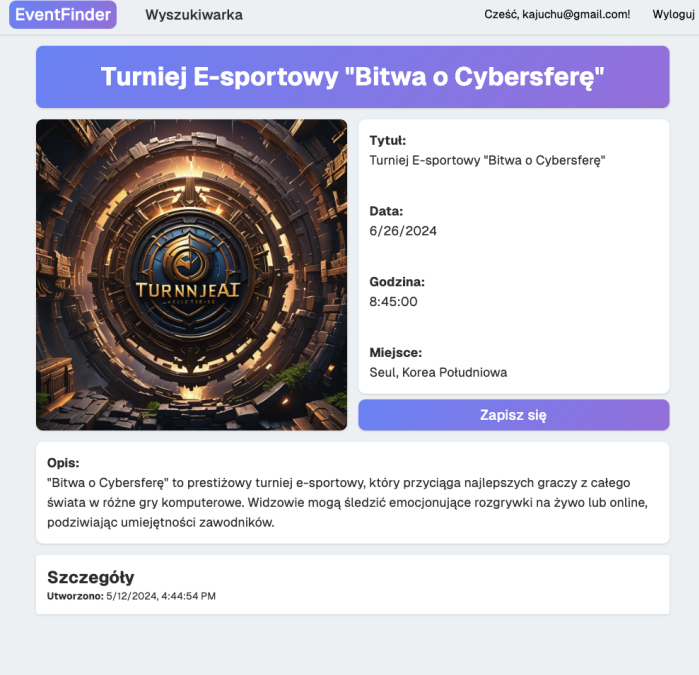
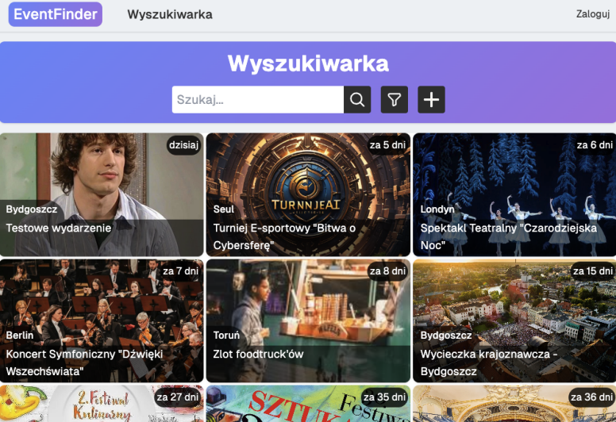

# EventFinder

EventFinder is a web application built with Next.js that helps users discover and manage local events. The platform allows users to browse a wide range of events, search for activities in specific locations, and register for events that match their interests.

The application provides an intuitive interface for exploring events, sorting them by category, and filtering results based on user preferences. Whether users are at home or traveling, EventFinder makes it easy to find interesting activities happening nearby.

## Features

* Browse available events
* Search events by location
* Filter and sort events by category
* View detailed event information
* Create and publish new events
* Register for events
* Manage event participation

## Requirements

* Node.js 18+
* npm

## Installation

```bash
npm install
```

## Environment Variables

Create a `.env` file based on `.env.example`.

## Running the Application

```bash
npm run dev
```

## Home Page

The home page displays available events and provides quick access to search, filtering, and event details.


## Creating a New Event

Users can create and publish new events by providing information such as the title, location, date, and description.



## Searching for Events

Users can search for events based on a specific location to discover activities happening nearby.


